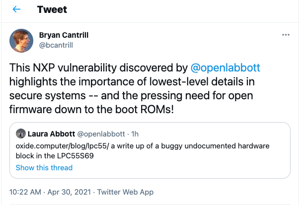
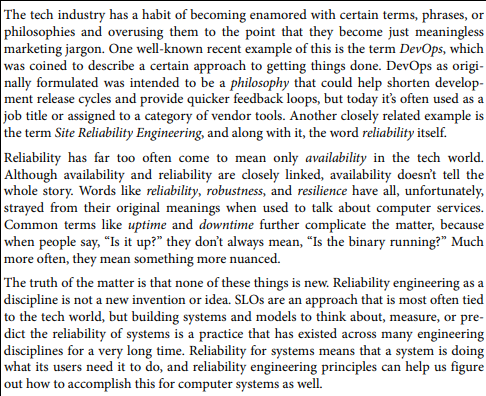
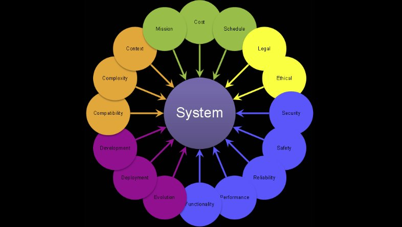

# Quality Attributes

Organizational boundaries are getting blurred between "Public" & "Private" spaces & imperative considering Complexity and Cognitive Load, Open Source, Deployment of Workloads to Public Cloud & "Edge". I think emergent patterns started in operating systems with 

1. UNIX 

-- [Brian Kernighan Unix: History and Memoir](https://www.youtube.com/watch?v=nS-0Vrmok6Y) (Chapter 9 is **Legacy / Technical, Organization, Recognition, Could history repeat?**)

2. Followed by Security with Bug bounty program

-- [importance of lowest-level details in secure systems and the pressing need for open firmware down to the boot ROMs!](https://twitter.com/bcantrill/status/1388181932068929538)

3. Now trending in Privacy, Observability & Ethics etc. 

-- https://twitter.com/mjasay 

-- [Open Source & Community / Kelsey Hightower, Developer & Open Source Advocate, Google Cloud](https://www.youtube.com/watch?v=jiaLsxjBeOQ) 

4. Applications are going through similar Interoperability with Open APIs.

- [A Brief, Opinionated History of the API](https://www.youtube.com/watch?v=LzMp6uQbmns) -> [Amazons](https://apievangelist.com/2012/01/12/the-secret-to-amazons-success-internal-apis/), [Banking](https://en.wikipedia.org/wiki/Open_banking), [Healthcare](https://www.hl7.org/fhir/), IoT, ... / [Cloud](https://kubernetes.io/docs/concepts/overview/kubernetes-api/), ...

5. Design Company as a System with Full "Observability" Models:

- [Complexity & Cognitive Work](https://www.researchgate.net/profile/David-Woods-19) -> https://www.adaptivecapacitylabs.com/blog/2019/01/30/human-cognitive-work-happens-above-the-line/

- Transparent Strategy
  * [Architecture Team - Wikimedia](https://www.mediawiki.org/wiki/Wikimedia_Architecture_Team#The_practice)
  * [Public Strategy Company - GitLab](https://about.gitlab.com/company/strategy/#why-is-this-page-public)
  * [About Company - Sourcegraph](https://about.sourcegraph.com/about/)

- Public Roadmap
  * https://github.com/aws?q=roadmap
  * https://github.com/github/roadmap

- [Open Software Design](https://notes.ceilfors.com/Open_software_design.html) -> https://upmo.com/dev/

## Non-Functional

> "We start by looking at which **“-ilities”** are most important to architects. A software architect is responsible for the cross-cutting concerns and making sure that individual components of a large system can work together seamlessly to meet overall objectives. In 2021, four areas we feel architects are concerned with are designing for resilience, designing for observability, designing for portability, and designing for sustainability." 

-- https://www.infoq.com/articles/architecture-trends-2021/

-- [From book Implementing Service Level Objectives](https://www.amazon.com/Implementing-Service-Level-Objectives-Practical/dp/1492076813)

## Functional

> "if building a software-intensive system, these are the forces we must weigh" https://twitter.com/ruthmalan/status/989206552044294145

* [On the criteria to be used in decomposing systems into modules](https://blog.acolyer.org/2016/09/05/on-the-criteria-to-be-used-in-decomposing-systems-into-modules/)
* [Revisiting Information Hiding](https://link.springer.com/chapter/10.1007%2F978-3-642-22655-7_8)
* [The theory of graceful extensibility](https://link.springer.com/article/10.1007/s10669-018-9708-3)

## Culture

> "culture is not a static ‘thing’ but something which everyone is constantly creating, affirming and expressing" -- Mary Douglas

### Culture is not a set of beliefs, a set of actions
 
> Companies & Culture: What You Do Is Who You Are - a16z editor in chief Sonal Chokshi interviews a16z co-founder Ben Horowitz -- author of the book What You Do Is > Who You Are -- on whether companies and people can change; how the very thing that is your strength can also be your weakness; how startups evolve from pirates to > the navy; actions vs words and values; and more.
 
https://a16z.simplecast.com/episodes/what-you-do-is-who-you-are-companies-culture-book-computer-history-museum-6JfGIJJs

### Culture is "Code"
 
> I am reading a book that was recommended by Kumar, Anil called "[Accelerate - Building and Scaling High Performing Technology Organizations by Nicole Forsgren, Jez Humble, and Gene Kim](https://www.amazon.com/Accelerate-Software-Performing-Technology-Organizations/dp/1942788339/)".  I am about 100 pages in and finally starting to understand the vision around our "destination" culture and honestly the "different cultures" that exist among our divisions.  
 
> On pg30 the book describes 3 types of organizational cultures.
 
> 1. **Pathological** (power oriented) organizations are characterized by large amounts of fear and threat.  People often hoard information or withhold it for political reasons, or distort it to make themselves look better.
> 2. **Bureaucratic** (rule-oriented) organizations protect departments.  Those in the department want to maintain their "turf", insist on their own rules, and generally do things by the book - their book.
> 3. **Generative** (performance-oriented) organizations focus on the mission.  How do we accomplish our goal?  Everything is subordinated to good performance, to doing what we are supposed to do.

> Moving forward in the book I'm learning about changes that need to be made around testing, version control, automation, CICD, communication, etc...  I am starting to be able to tie ideas that are nicely articulated in the book to statements I've heard in meetings by folks like Kumar, Anil, Raghavendra, Vijay, and Charlton, Paul.  Wow.  This is so cool...  It's like a giant light bulb turned on this week!

> I believe our destination culture is Generative.  I also feel that "we all kinda want it".  So, I'm getting excited about what the future holds...

> I recommend that all Tech managers & Architects get a copy of this book and read through it.

> Cheers!  ~https://www.linkedin.com/in/timothycdahl/

* [Technical Leadership Masterclass](https://www.ruthmalan.com/Bredemeyer/Technical_Leadership_Masterclass_Overview.htm)
* [Staff-plus](https://staffeng.com/guides)
* [Sample of Career ladders](https://github.com/sdras/career-ladders)

## Build

> "distinction between physical and digital will disappear" 
> https://www.admcloudtech.com/2021/04/06/amazon-cto-aws-will-erase-the-line-between-physical-and-digital/ 
> 
* [A Conversation with Werner Vogels](https://queue.acm.org/detail.cfm?id=1142065)
* [A Second Conversation with Werner Vogels](https://queue.acm.org/detail.cfm?id=3434573)

* [The Amazon Builders' Library](https://aws.amazon.com/builders-library/)

## Tools

Called [Backyard](https://github.com/ankumar/Architecture/blob/main/Patterns/History.md#platform--tools--yahoo) at Yahoo!, Now Backstage open source project Incubated by Spotify, Adopted as Runway@American Airlines, 

* https://engineering.atspotify.com/2021/03/16/happy-birthday-backstage-spotifys-biggest-open-source-project-grows-up-fast/

Likely termed **"Internal Platforms"** @Hundreds of organizations ...

> "There's a lot of hype around developer productivity platforms..."
-- https://twitter.com/martinfowler/status/1387041315196702720

## Learn

* [List of Resources](https://github.com/ankumar/Architecture/wiki)

